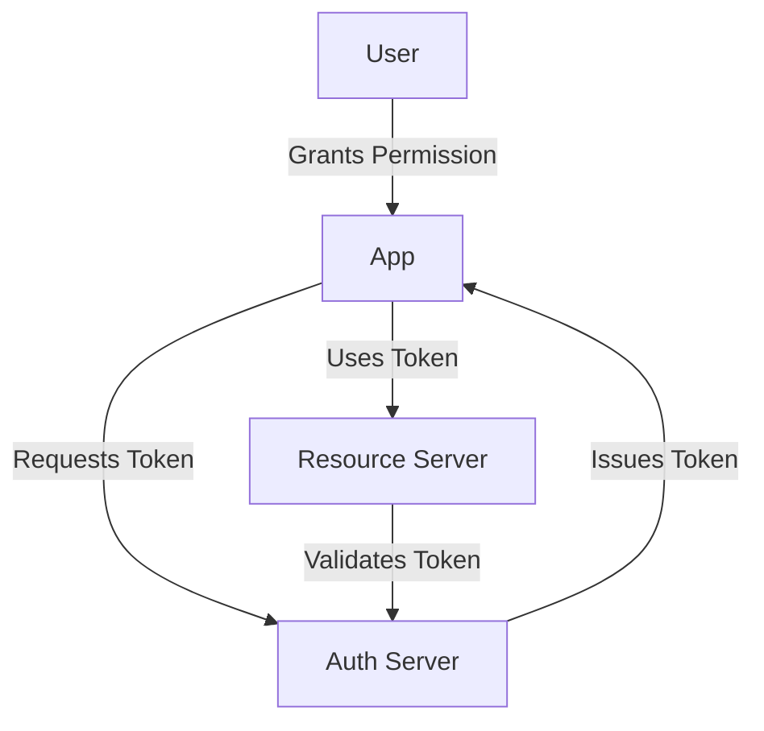

### **SPRING SECURITY**

#### **1: Purpose & Usage**
**Q: Why is Spring Security needed?**
**A:**  
✔ Protects sensitive data.  
✔ Ensures only authorized users access resources.  
✔ Handles authentication & authorization automatically.  

#### **2: Authentication Types**
**Q: What are the types of authentication in Spring Security?**  
**A:**  
✔ Knowledge-based: Passwords.  
✔ Possession-based: Phone, key card.  
✔ Multifactor: Combines both.  

#### **3: Core Concepts**
**Q: What are the core concepts of Spring Security?**  
**A:**  
✔ Authentication: Identifying users.  
✔ Authorization: Defining user permissions.  
✔ Principal: Logged-in user.  
✔ Granted Authority: User's permissions.  
✔ Roles: Groups of authorities.  

#### **4: Implementing Spring Security in Spring Boot**
**Q: How is Spring Security implemented in Spring Boot?**  
**A:**  
1️⃣ Add `spring-boot-starter-security` dependency.  
```xml
<dependency>
    <groupId>org.springframework.boot</groupId>
    <artifactId>spring-boot-starter-security</artifactId>
</dependency>
```
2️⃣ Auto-handles authentication & authorization.  
3️⃣ Generates a default password for login.  

#### **5: What is OAuth 2.0?**
**Q: What is OAuth 2.0?**  
**A:**  
✔ Protocol for secure authorization without sharing passwords --> example: google sign-in applications.  
✔ Grants access tokens for user data.  

#### **6: OAuth 2.0 - Key Concepts**
**Q: What are the key concepts of OAuth 2.0?**  
**A:**  
✔ Authentication: "Who are you?"  
✔ Authorization: "What can you do?"  

#### **7: OAuth 2.0 - Workflow**
**Q: What is the OAuth 2.0 workflow?**  
**A:**  
1️⃣ User Authorization: Grants permission to an app.  
2️⃣ Token Exchange: Access token is issued.  
3️⃣ Resource Access: App uses token to fetch data.  
4️⃣ Token Management: Refresh tokens prevent re-login.  


#### **8: OAuth 2.0 - Scopes & Tokens**
**Q: What are scopes and tokens in OAuth 2.0?**  
**A:**  
✔ Scopes: Define permissions (e.g., read, write).  
✔ Tokens: Represent granted authorization (access, refresh).  

#### **9: OAuth 2.0 - Grant Types**
**Q: What are the different grant types in OAuth 2.0?**  
**A:**  
1️⃣ Authorization Code Grant.  
2️⃣ Implicit Grant.  
3️⃣ Resource Owner Password Credentials Grant (ROPC).  
4️⃣ Client Credentials Grant.  
5️⃣ Refresh Token Grant.  

#### **10: Why OAuth 2.0 Uses Tokens**
**Q: Why does OAuth 2.0 use tokens?**  
**A:**  
✔ Secure transmission & granular access control.  
✔ Avoids exposing credentials in every request.  

#### **11: JWT - Why Use JWT?**
**Q: Why use JWT?**  
**A:**  
✔ Secure: Signed with a hashing algorithm for integrity.  
✔ Used for authentication & authorization.  

#### **12: JWT - Structure**
**Q: What is the structure of a JWT?**  
**A:**  
1️⃣ Header: Metadata (token type, hashing algorithm).  
2️⃣ Payload: Claims about user & data (user info, expiration).  
3️⃣ Signature: Ensures token integrity & authenticity.  
```json
{
  "header": {
    "alg": "HS256",
    "typ": "JWT"
  },
  "payload": {
    "sub": "1234567890",
    "name": "John Doe",
    "iat": 1516239022
  },
  "signature": "SflKxwRJSMeKKF2QT4fwpMeJf36POk6yJV_adQssw5c"
}
```

#### **13: JWT - Claims**
**Q: What are the claims in JWT?**  
**A:**  
✔ Reserved Claims: Predefined (e.g., iss, sub, exp).  
✔ Public Claims: Custom (e.g., user data).  
✔ Private Claims: App-specific data.  

#### **14: JWT - Validating JWT**
**Q: How is a JWT validated?**  
**A:**  
✔ Resource Server verifies signature using the public key of the auth server.  
✔ No server communication needed: Local validation possible.  
```java
public class JwtUtil {
    private String secretKey = "secret";

    public Claims extractAllClaims(String token) {
        return Jwts.parser().setSigningKey(secretKey).parseClaimsJws(token).getBody();
    }

    public Boolean validateToken(String token, UserDetails userDetails) {
        final String username = extractUsername(token);
        return (username.equals(userDetails.getUsername()) && !isTokenExpired(token));
    }
}
```

---
This set provides **quick, structured** insights into **Spring Security**, OAuth2, and JWT with key concepts and workflows. 🚀
